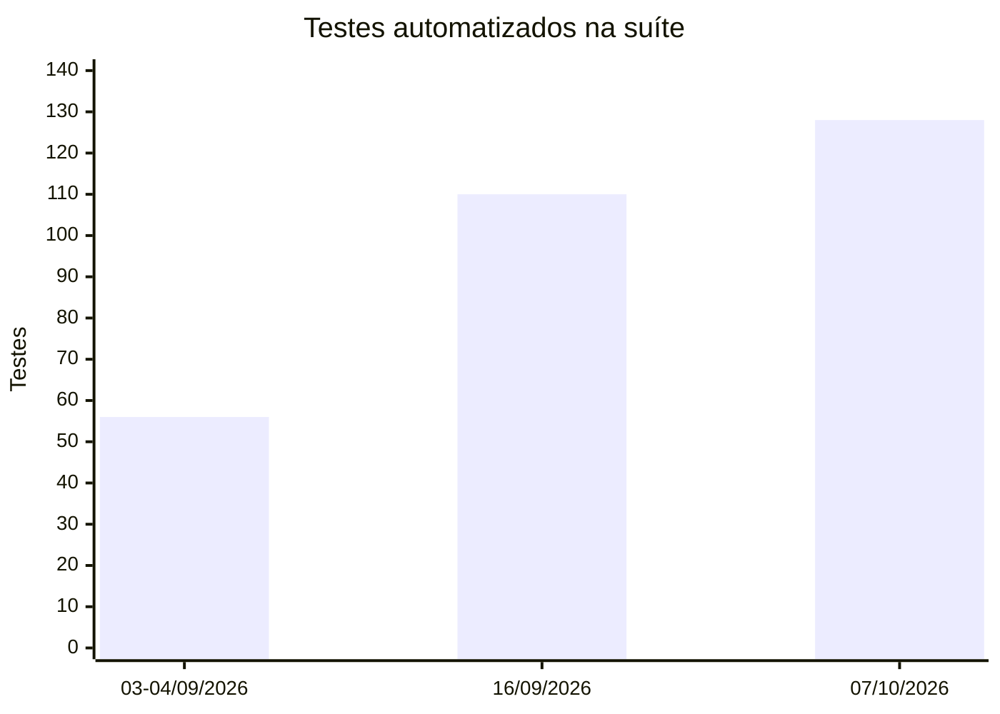
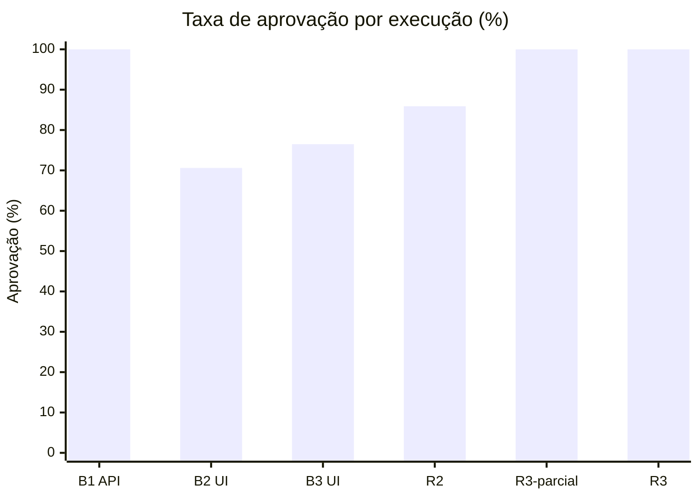

# Métricas

Painel de métricas do toSwim em três frentes: **o que foi planejado e entregue**, **a cobertura de testes** e **os resultados de execução**. Cada número informa a **fonte** e a **fórmula**. Os percentuais estão arredondados para uma casa decimal. Voltar para a [Home](Home).

> **Como ler os indicadores visuais**
>
> - **Barras `█░`:** 10 células, cada uma equivalendo a 10%. O valor é **arredondado para baixo**, então a barra só fica cheia em 100%.
> - **Quadrados coloridos:** cada quadrado é **um item**. 🟩 implementado · 🟨 parcial · 🟧 divergente · 🟥 não implementado. Os números ficam sempre ao lado das cores, então a cor nunca é a única informação.
> - **Gráficos de barras:** são desenhados com Mermaid. Se a Wiki não exibir algum gráfico, a tabela logo abaixo dele tem os mesmos dados.

## Painel geral

| 📋 Suíte | ✅ Casos automatizados | 🖥️ Telas entregues | 🎯 Cenários do documento com caso | ▶️ Última execução (R3) | 🔀 Divergências |
|:---:|:---:|:---:|:---:|:---:|:---:|
| **128** testes | **96,0%** | **5 de 7** | **19 de 38** | **128/128** aprovados¹ | **6** |
| 92 API · 36 UI | 120 de 125 casos | 71,4% | 50,0% | 07/10/2026 | para decisão de produto |

¹ A R3 consta como **registro escrito** em `docs/matriz-testes.md`, sem relatório anexado. Veja [Execução e Evidências](Execucao-e-Evidencias).

---

## 1. Planejado × Entregue

**Fontes:** o documento de requisitos "toSwim - Documento.pdf" e a classificação de [Planejado × Entregue](Planejado-x-Entregue). "Implementado" significa que o comportamento existe no código, e não que foi validado por teste.

### 1.1 Telas do documento

```
Telas com rota no frontend   ███████░░░  71,4%   (5 de 7)
```

| Tela | Situação | Rota |
|---|---|---|
| Login | ✅ Implementado | `/login` |
| Ficha de Treino | 🟡 Parcial | `/fichas` |
| Execução do treino | 🟡 Parcial (somente o treino comum) | `/treino-execucao` |
| Histórico de Treinos | 🟡 Parcial | `/historico` |
| Metas | 🟡 Parcial | `/metas` |
| Tela Inicial | ❌ Não implementada | — |
| Detalhe da Meta | ❌ Não implementada | — |

### 1.2 Critérios de aceite e regras por tela

Cada quadrado é um critério ou regra avaliado em [Planejado × Entregue](Planejado-x-Entregue). Para a Tela Inicial e o Detalhe da Meta, que não foram implementados, contei os critérios de aceite do documento: 7 e 10.

| Tela | Critérios e regras | 🟩 | 🟨 | 🟧 | 🟥 | Total |
|---|---|:---:|:---:|:---:|:---:|:---:|
| Login | 🟩🟩🟩🟩🟩🟧🟧 | 5 | 0 | 2 | 0 | 7 |
| Ficha de Treino | 🟩🟩🟩🟩🟩🟧🟧🟧 | 5 | 0 | 3 | 0 | 8 |
| Execução do treino | 🟩🟩🟩🟩🟩🟨🟧🟥🟥🟥 | 5 | 1 | 1 | 3 | 10 |
| Histórico de Treinos | 🟩🟩🟩🟩🟩🟨🟨🟥🟥 | 5 | 2 | 0 | 2 | 9 |
| Metas | 🟩🟩🟩🟩🟩🟩🟩🟩🟨🟧🟥🟥 | 8 | 1 | 1 | 2 | 12 |
| Tela Inicial | 🟥🟥🟥🟥🟥🟥🟥 | 0 | 0 | 0 | 7 | 7 |
| Detalhe da Meta | 🟥🟥🟥🟥🟥🟥🟥🟥🟥🟥 | 0 | 0 | 0 | 10 | 10 |
| **Total** | | **28** | **4** | **7** | **24** | **63** |

```
Implementado       ████░░░░░░  44,4%   (28 de 63)
Parcial            ░░░░░░░░░░   6,3%   ( 4 de 63)
Divergente         █░░░░░░░░░  11,1%   ( 7 de 63)
Não implementado   ███░░░░░░░  38,1%   (24 de 63)
```

**Leitura:** fora a Tela Inicial e o Detalhe da Meta, a maior parte dos critérios das telas entregues está implementada (28 de 46, ou 60,9%). As lacunas se concentram em **Execução** (treino de meta de distância e vínculo com a meta) e **Metas** (tipo de meta e tela de detalhe).

O item "Exibir o tipo de meta" está marcado como ❌🔀 em Planejado × Entregue e foi contado como 🟥.

### 1.3 Objetivos do sistema

| Objetivo do documento | Situação |
|---|---|
| Criar fichas de treino base | 🟩 |
| Reutilizar treinos em diferentes dias | 🟩 |
| Registrar a execução do treino do dia | 🟩 |
| Manter os dados separados por usuário | 🟩 |
| Calcular pace e demais métricas | 🟨 Métricas só na API |
| Criar e acompanhar metas | 🟨 Sem tela de detalhe |
| Consultar histórico e evolução | 🟨 Evolução só na API |

```
Objetivos atendidos        █████░░░░░  57,1%   (4 de 7)
Objetivos parcialmente     ████░░░░░░  42,9%   (3 de 7)
```

### 1.4 Cenários de teste do documento com caso relacionado

A relação entre cenário e caso está em [Planejado × Entregue](Planejado-x-Entregue). Ter caso relacionado **não significa** que o cenário foi validado por inteiro, porque há diferenças registradas em vários deles. Este indicador **não é** uma taxa de aprovação.

| Tela | Cobertura | % | Cenários |
|---|---|:---:|:---:|
| Login | `██████████` | 100,0% | 5 de 5 |
| Ficha de Treino | `████████░░` | 83,3% | 5 de 6 |
| Metas | `████████░░` | 80,0% | 4 de 5 |
| Histórico de Treinos | `██████░░░░` | 66,7% | 4 de 6 |
| Execução do treino | `█░░░░░░░░░` | 16,7% | 1 de 6 |
| Tela Inicial | `░░░░░░░░░░` | 0,0% | 0 de 5 |
| Detalhe da Meta | `░░░░░░░░░░` | 0,0% | 0 de 5 |
| **Total** | `█████░░░░░` | **50,0%** | **19 de 38** |

### 1.5 Divergências entre documento e implementação

Há **6 divergências** registradas em [Planejado × Entregue](Planejado-x-Entregue#principais-divergências-planejadas-x-implementadas), para decisão de produto. Elas não foram registradas como defeitos.

| Tema | Casos afetados |
|---|---|
| Ficha sem séries pode ser salva | FICHA-003, UI-FICHA-002, TREINO-007 |
| Destino após o login (`/fichas`, sem tela inicial) | UI-LOGIN-001, UI-LOGIN-002, NAV-001 |
| Escolha da piscina fora do login | PISC-*, FICHA-013..017 |
| Sem tipos de meta | META-004, META-005 |
| Criar meta por diálogo | Teste sem ID `ui/metas.spec.ts:15` |
| Detalhes por diálogo ou inexistentes | Teste sem ID `ui/historico.spec.ts:67` |

---

## 2. Cobertura de testes

**Fontes:** `docs/matriz-testes.md` e os arquivos `e2e/tests` (commit `664eb29`).

### 2.1 Automação e rastreabilidade

```
Casos da matriz com teste automatizado   █████████░  96,0%   (120 de 125)
Testes da suíte com ID na matriz         █████████░  93,8%   (120 de 128)
```

| Métrica | Valor | Fórmula |
|---|---|---|
| Testes automatizados | **128** (92 API + 36 UI) | Contagem de `test(` em `e2e/tests` |
| Casos com ID na matriz | **125** | Contagem de linhas com ID na matriz |
| Cobertura de automação | **96,0%** | casos com teste ÷ casos = 120 ÷ 125 |
| Rastreabilidade | **93,8%** | testes com ID ÷ testes = 120 ÷ 128. Os 8 testes sem ID estão em [Casos de Teste](Casos-de-Teste#testes-automatizados-sem-id-na-matriz). |
| Casos pendentes | **5** | AUTH-008, AUTH-010, SERIE-006, META-011, METR-005 (4 de prioridade Média e 1 Baixa, todos de API) |

### 2.2 Automação por funcionalidade

| Funcionalidade | Automação | % | Casos com teste |
|---|---|:---:|:---:|
| Configuração de piscina | `██████████` | 100,0% | 8 de 8 |
| Treinos: execução | `██████████` | 100,0% | 20 de 20 |
| Histórico | `██████████` | 100,0% | 7 de 7 |
| Usuários | `██████████` | 100,0% | 3 de 3 |
| Cadastro e login (UI) | `██████████` | 100,0% | 9 de 9 |
| Navegação e rotas (UI) | `██████████` | 100,0% | 5 de 5 |
| Fichas base e séries | `█████████░` | 97,4% | 37 de 38 |
| Metas de tempo | `█████████░` | 95,0% | 19 de 20 |
| Autenticação | `████████░░` | 80,0% | 8 de 10 |
| Métricas | `████████░░` | 80,0% | 4 de 5 |

### 2.3 Evolução do tamanho da suíte



| Data | Testes | API | UI | Fonte |
|---|:---:|:---:|:---:|---|
| 03–04/09/2026 | 56 | 39 | 17 | Logs B1–B3 e relatório HTML |
| 16/09/2026 | 110 | 82 | 28 | Registro escrito na matriz |
| 07/10/2026 | 128 | 92 | 36 | Código e registro escrito (R3) |

A suíte cresceu **128,6%** entre setembro e outubro: (128 − 56) ÷ 56.

### 2.4 Distribuição dos 125 casos da matriz

```
Prioridade Alta    ████████░░  80,0%   (100)
Prioridade Média   █░░░░░░░░░  18,4%   ( 23)
Prioridade Baixa   ░░░░░░░░░░   1,6%   (  2)

Camada API         ███████░░░  77,6%   ( 97)
Camada UI          ██░░░░░░░░  22,4%   ( 28)
```

### 2.5 Cobertura de endpoints da API

```
Chamados diretamente por testes    ███████░░░  72,5%   (37 de 51)
Chamados só indiretamente (UI)     ░░░░░░░░░░   3,9%   ( 2 de 51)
Sem nenhuma chamada                ██░░░░░░░░  23,5%   (12 de 51)
```

O total de 51 endpoints vem da contagem de atributos `[Http*]` nos controllers. A classificação em direto, indireto e sem chamada vem da matriz (rodada final). Os 12 endpoints sem chamada estão na [Matriz de Cobertura](Matriz-de-Cobertura).

---

## 3. Resultados de execução

**Fórmula:** `taxa de aprovação = aprovados ÷ (aprovados + reprovados) × 100`

Testes ignorados (*skipped*) e não executados ficam fora do denominador.



| Execução | Taxa | Aprovados / reprovados | Nível de evidência |
|---|---|:---:|---|
| B1 — API, 03/09/2026 | `██████████` 100,0% | 39 / 0 | Log bruto |
| B2 — UI, 03/09/2026 23:52 | `███████░░░` 70,6% | 12 / 5 | Log bruto |
| B3 — UI, 04/09/2026 00:01 | `███████░░░` 76,5% | 13 / 4 | Log bruto |
| HR — relatório HTML, 04/09/2026 | Não calculável | 0 / 0 (56 ignorados) | Relatório HTML |
| R2 — arquivos afetados, 06/10/2026 | `████████░░` 85,9% | 55 / 9 | Registro escrito |
| R3-parcial — arquivos afetados, 06/10/2026 | `██████████` 100,0% | 64 / 0 | Registro escrito |
| **R3 — suíte completa, 07/10/2026** | `██████████` **100,0%** | **128 / 0** | Registro escrito |

- **Os níveis de evidência são diferentes.** B1–B3 têm log bruto por teste. R2, R3-parcial e R3 são **registros escritos** com totais. O gráfico coloca as execuções lado a lado, mas isso não as torna equivalentes.
- **R3-iso:** 3 tentativas de **1 único caso** (UI-FICHA-001), com 3 aprovações. Ela não entra como taxa de casos, porque são repetições do mesmo teste.
- Não houve retentativas automáticas nas execuções locais, porque `retries: 0` fora de CI.

---

## 4. Defeitos e retestes

**Fonte:** [Defeitos e Retestes](Defeitos-e-Retestes). Os registros não têm ID formal nem severidade.

| Indicador | Visual | Quantidade |
|---|---|:---:|
| Defeitos do produto corrigidos ([Registros 1 a 3](Defeitos-e-Retestes#registro-1)) | 🟩🟩🟩 | 3 |
| Problemas da própria suíte, como instabilidade ou defeito de teste ([Registros 4 a 6](Defeitos-e-Retestes#registro-4)) | 🟧🟧🟧 | 3 |
| Casos que falharam na R2 e passaram no reteste (R3-parcial e R3) | 🟩🟩🟩🟩🟩🟩 | 6 |

Os casos retestados são FICHA-020, FICHA-021, UI-FICHA-004, UI-LOGIN-003, UI-LOGIN-004 e UI-FICHA-001.

---

## Métricas não calculadas

| Métrica | Motivo |
|---|---|
| Densidade de defeitos | Os defeitos não têm ID formal e severidade, nem há uma base de tamanho definida |
| Tempo médio de correção | As datas de abertura e correção não foram registradas |
| Defeitos por severidade | A severidade não foi registrada |
| Taxa de aprovação de execução manual | Nenhuma execução manual foi registrada |
| Cobertura de critérios de aceite validada por teste | Os casos não foram validados um a um contra os critérios do documento. A relação da seção 1.4 é indicativa. |
| Taxa de aprovação por caso ao longo do tempo | Só há resultado por caso nos logs B1–B3. As demais rodadas registram apenas totais. |